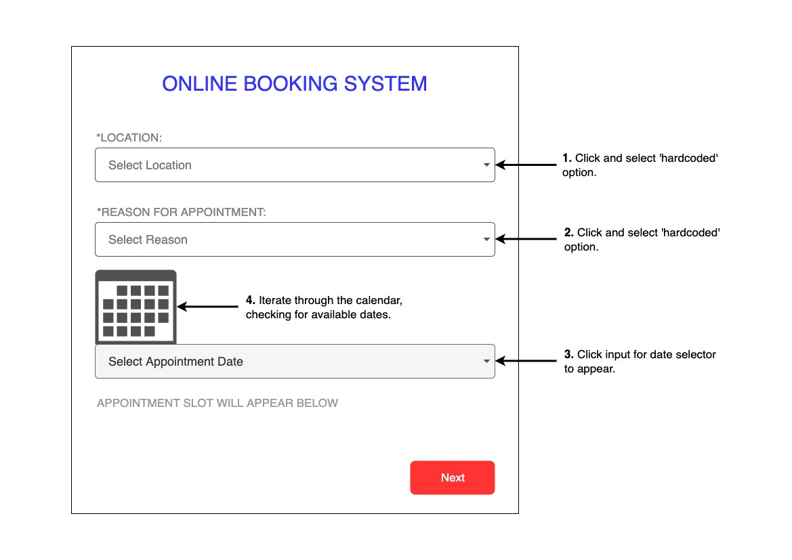

# Appoinment Checker

Appointment Checker is a Python Script made to scrape a particular site<sup>\*</sup> to determine if there are any available appointments. It works by pre-filling required inputs and then cycling through the calendar to find open spots. If an available slot is found, it notifies all subscribers via email and SMS.

> <sup>\*</sup> The site in question will not be mentioned here to avoid others using this script for unintended purposes.

## How It Works?

The appointment checker script works in the same way a person would navigate the site:

1. Click and select a preferred location from the 1st drop-down field.

2. Click and select the reason for their appointment from the 2nd field.

3. Click on the date input field for the date selector to appear.

4. Cycle through the calendar, checking for any available dates.

For a more in-depth explanation, including technical details; check out my blog here: https://blog.thanesh.io/Writing-an-Appointment-Checker/



## Setup

### 1. Check you have Python3 and PIP3 installed

```bash
python3 --version
pip3 --version
```

If you don't have these installed, make sure you install them before proceeding to the next step.

### 2. Clone the repository

```bash
git clone https://github.com/thaneshp/appointment-checker
```

### 3. Install required modules

Navigate into the repository and run the following command to install all the required Python modules.

```bash
pip3 install -r requirements.txt
```

### 4. Create keys.py

Next, you'll have to create a `keys.py` file in the appointment-checker folder of the directory. This file should contain the keys required to run the script.

Copy/paste the following text into your `keys.py` file and populate the fields accordingly.

```python
DRIVER_PATH="../chromedriver"
TARGET_WEBSITE=""

# Sender email details
EMAIL_ADDRESS=""
EMAIL_PASSWORD=""

# Twilio API Keys
ACCOUNT_SID = ""
AUTH_TOKEN = ""
PHONE_NUMBER = ""

# Subscriber list
SUBSCRIBER_EMAIL_LIST=""
SUBSCRIBER_PHONE_LIST=[]
```

### 5. Run the script

```bash
cd appointment-checker
python3 main.py
```

## Disclaimer

This script was developed for educational purposes only. The use of this code is your responsibility; I take no responsibility and/or liability for how you choose to use any of the source code available here.

By using any of the files available in this repository, you understand that you agree to use them at your own risk.
